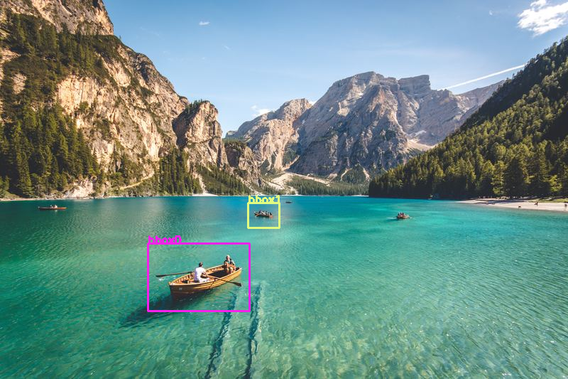
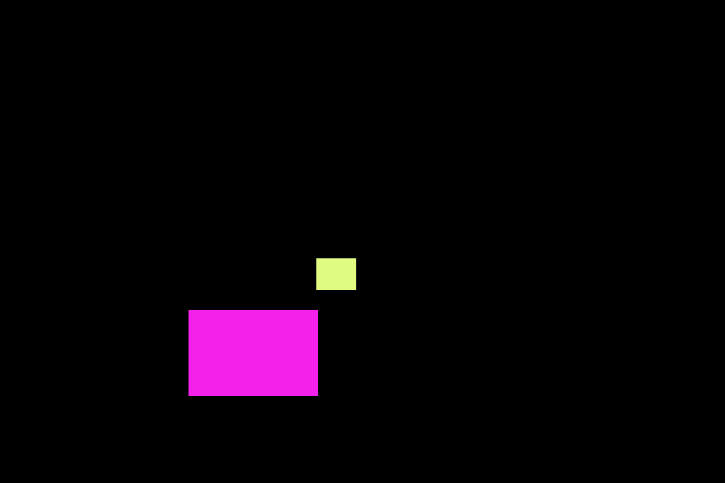
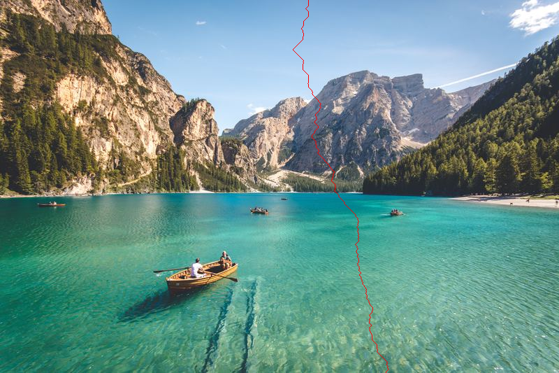

# Nesne Korumalı Seam Carving - Object Protected Seam Carving

**Versiyon	:**  2.0 		 
**Lisans  	:**  GPL 		 
**Contributors  :**  Burak Büyükyüksel	 

## Seam Carving Nedir ?

İçerik değerlendirmeli yeniden boyutlama işlemidir.

## Kullanım Alanları Nerelerdir?

*	<i> Görüntü kırpma, yeniden boyutlandırma gibi görüntü yükleme alanlarının <b>hepsi</b> </i>

## Gereksinimler
* <i>python 3.8</i>
* <i>requirements.txt</i>

### Gereksininlerin Kurulması
<i> Windows için:</i>
* pip install virtualenv
* venv\Scripts\activate.bat
* pip install -r requirements.txt

## Kullanım
### Parametreler
* <i>"-i", "--input"     , required=True,                                type=str        help="input image path"</i>
* <i>"-o", "--output"    , required=False, default="results/output.png", type=str,       help="output image path"</i>
* <i>"-c", "--c_rate"    , required=False, default=None,                 type=float,     help="column cropping rate"</i>
* <i>"-r", "--r_rate"    , required=False, default=None,                 type=float,     help="row cropping rate"</i>
* <i>"-t", "--threshold" , required=False, default=0.85,                 type=float,     help="predict threshold"</i>
* <i>"-f", "--file"      , required=False, default=None,                 type=str,       help="JSON notations file"</i>

### Örnek Kullanım
* python main.py --input "images/lake.jpg" --output "results/result.png" --c_rate 0.9 --r_rate 0.9 --threshold 0.85 --file "BBOXs.json"
* python main.py --input "images/lake.jpg" --output "results/result.png" --c_rate 0.9 --r_rate 0.9 --threshold 0.85
* python main.py --input "images/lake.jpg" --output "results/result.png" --c_rate 0.75
* python main.py --input "images/lake.jpg" --output "results/result.png" --r_rate 0.65

## Çıktılar
<table>
	<tr>
		<th colspan=3> <b> Uygulama İçerisinden </b> </th>	
	</tr>
	<tr>
		<td> </td>
		<td> </td>
		<td> </td>
	</tr>
	<tr>
		<td> </td>
		<td> </td>
		<td> </td>
	</tr>
</table>

## Changelog

### 1.0
* Released : January 5, 2020

-> Initial release